<p align="center">
    
</p>

<h2 align="center"> CTFGames </h2>

<h4 align="center"> A modern CTF platform with a clean yet expressive design. </h4>

<p align="center">
    
    
</p>

### Setup Environment
1. Create a virtual environment :
```bash
# Let's install virtualenv first
pip install virtualenv

# Then we create our virtual environment
virtualenv env

```

2. Activate the virtual environment :
```bash
env\Scripts\activate

```

3. Install the requirements :
```bash
pip install -r requirements.txt

```


### Running the App

To run the app, simply execute following command :
```bash
python manage.py runserver
```

### Note
The version of these packages are for Python 3.10, if you use Python 3.11 or above, maybe these versions will not work.

## Preview!

#### Homepage

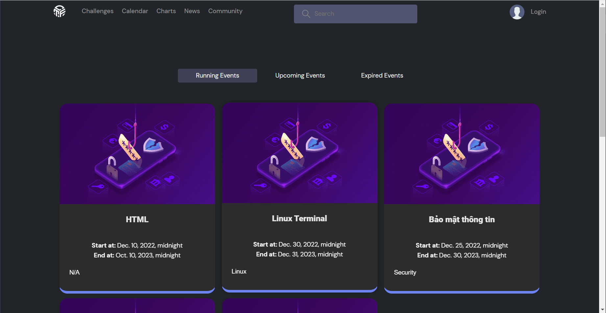

#### Login

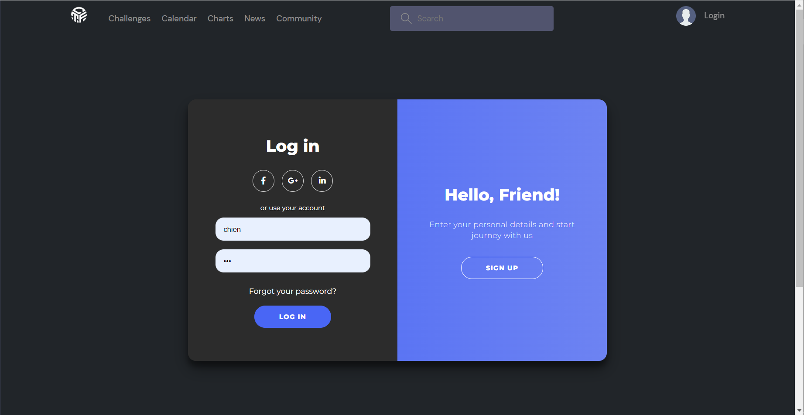

#### Homepage after login

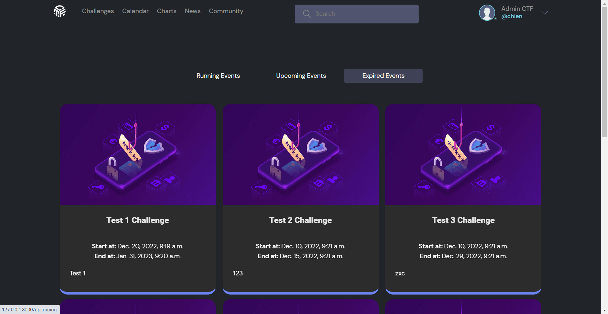

#### Create Challenge

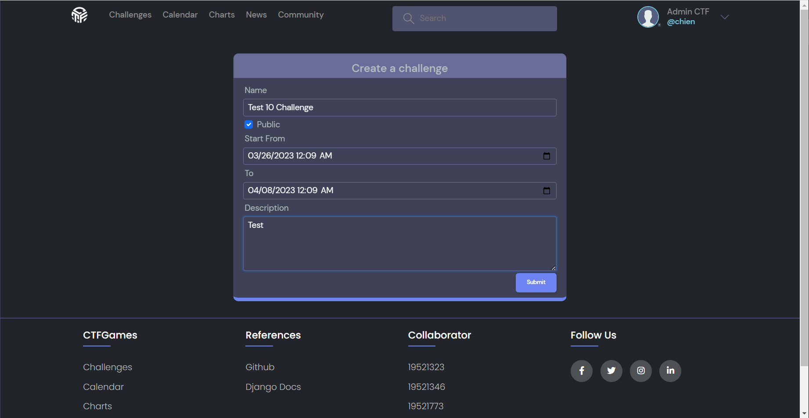

#### Create Question

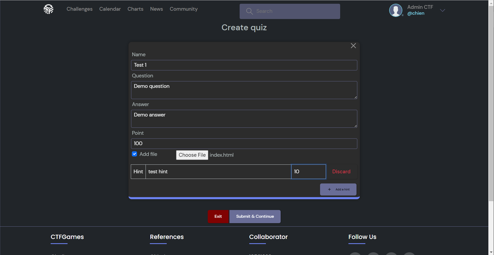

#### Created Challenge

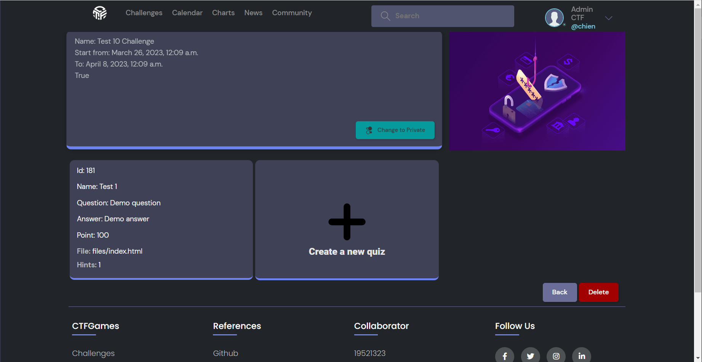

#### Join Challenge

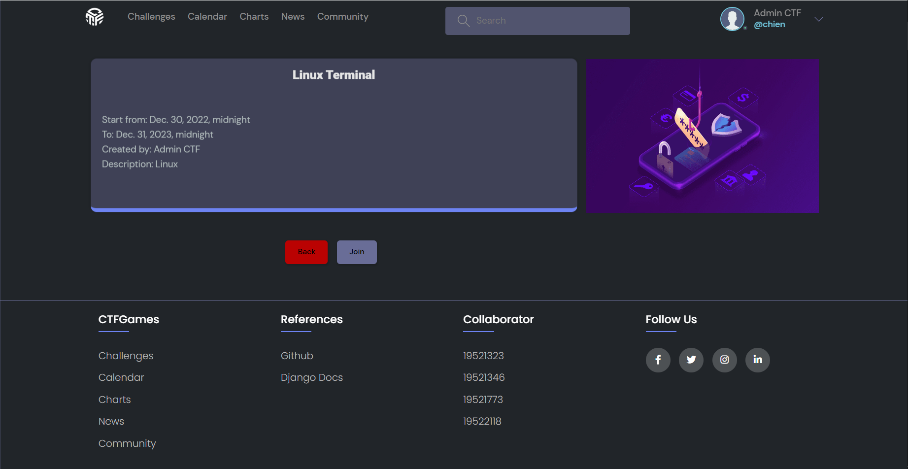

#### List Questions

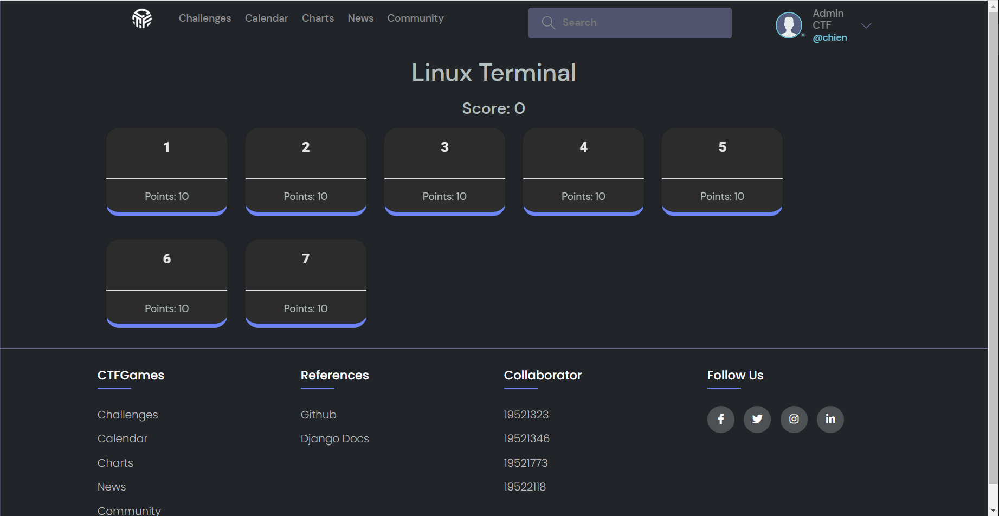

#### Play A Quizz

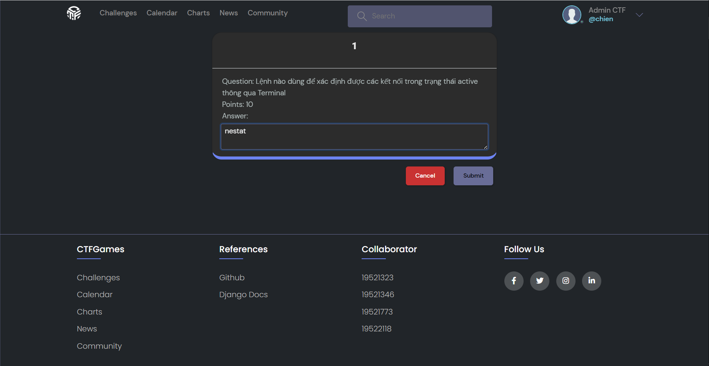

#### Result

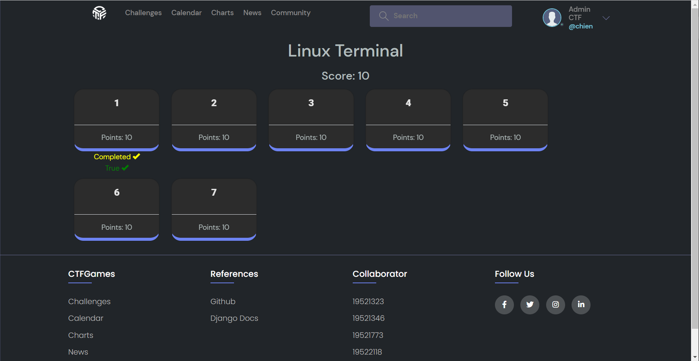

#### Calendar

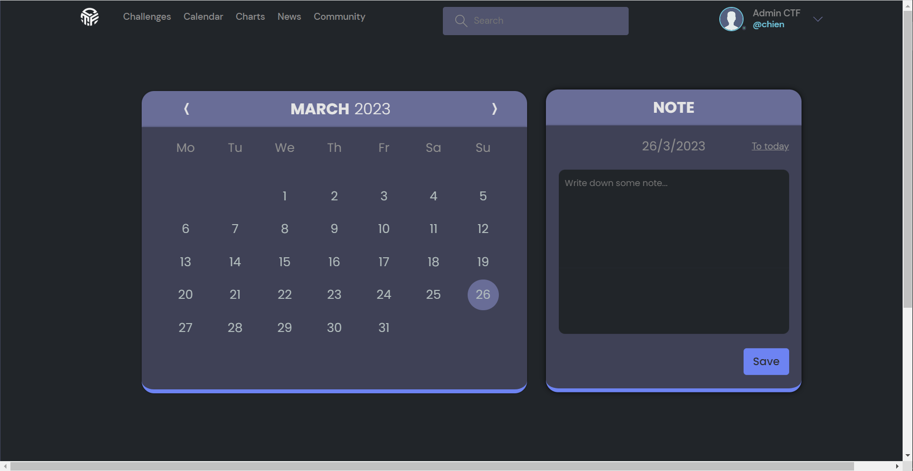

#### Chart

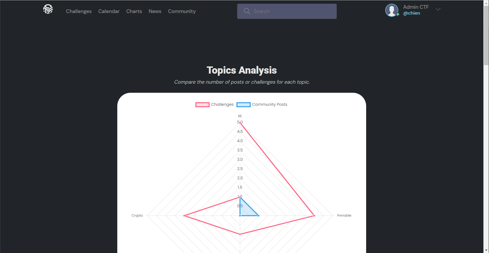

#### News

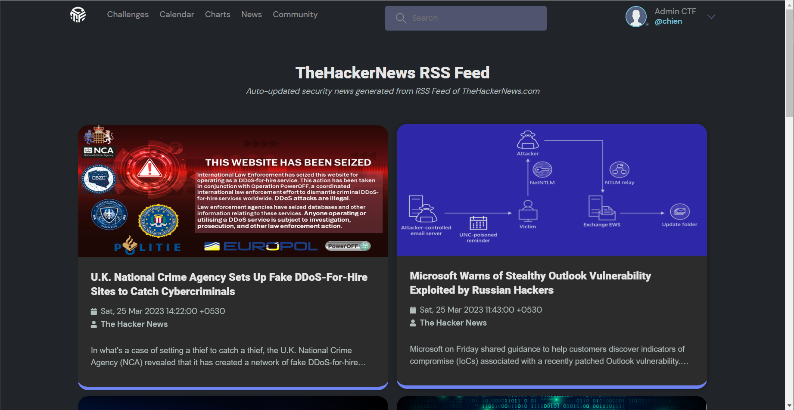

#### Community

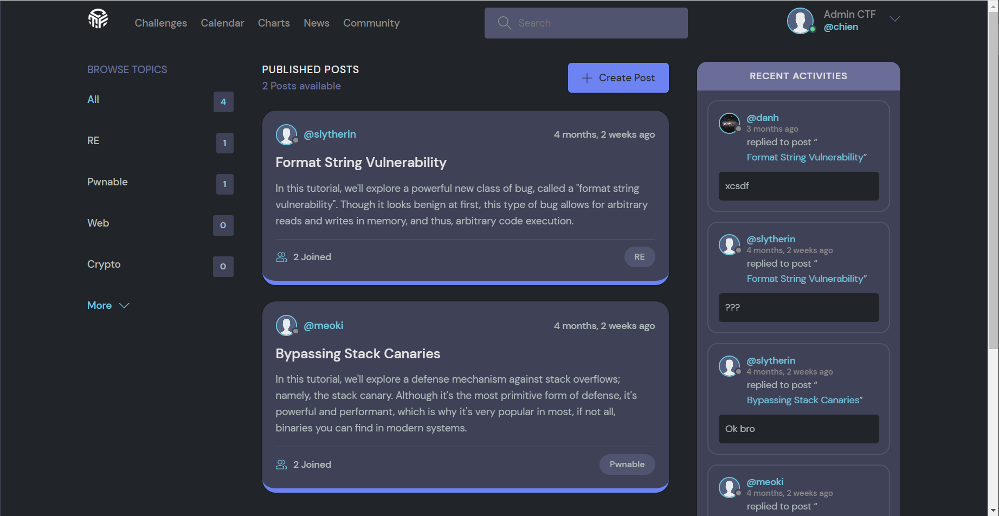

#### Admin Dashboard

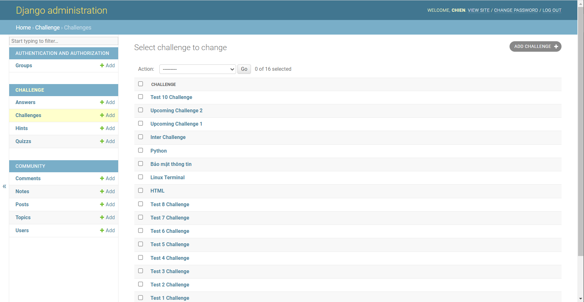


